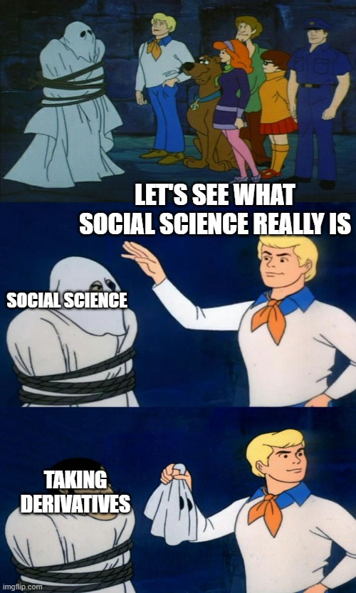

# Course Overview

ECON 251 ("Price and Allocation Theory") introduces students to the microeconomic approach to the study of human behavior, with a
focus on individual decision-making and strategic interactions. We study the behavior
of individuals and households in a variety of consumption settings (including buying goods and services,
labor supply, saving for the future, and investing in human capital and preventive health); risk and time
preferences; the behavior of producers of goods and services; market inter-
actions and market failures; game theory; and imperfect information.

My approach to intermediate microeconomics may differ from the approach taken by other
faculty members, reflecting my research interests in behavioral economics and international
development. Much of the most interesting microeconomic research from the last several decades
is focused on the ways that traditional economic models - of perfect markets, of self-
interested consumers, etc. - are wrong in important, substantive ways. Our focus in
this course is on learning to use the mathematical tools of economics to build testable,
empirically valid models of individual choices in a range of settings. 

 

## Mathematical Preparation

The math prereqs for ECON 251, in meme form, courtesy of University of Minnesota 
PhD student and meme guru [Khoa Vu](https://sites.google.com/view/khoavu-umn/home):

This course is hard.  ECON 251 may well be the hardest course 
you take at Williams (that is what some of my past students 
have said).  It involves a lot of math, particularly calculus.  You will take **a lot** of derivates and 
solve an extraordinary number of constrained optimization problems.  You need to be comfortable with calculus 
going into the course if you hope to do well.  Students who have not 
completed or placed out of MATH 130 should not enroll in the course.  Even 
if you have completed the necessary prerequisites, you may wish to delay taking ECON 251 until you have built a strong foundation 
in calculus and probability/statistics.  Familiarity with multivariable calculus is helpful but not required as we will be 
using partial derivatives throughout the course.  Some familiarity with statistics and probability is very helpful.  Most 
Williams students take ECON 251 in their second year, by which time they have typically completed STAT 161.  Students who have not completed or 
placed out of at least one college-level stats course may wish to delay taking ECON 251 until they have built a stronger foundation in 
probability and statistics.  
